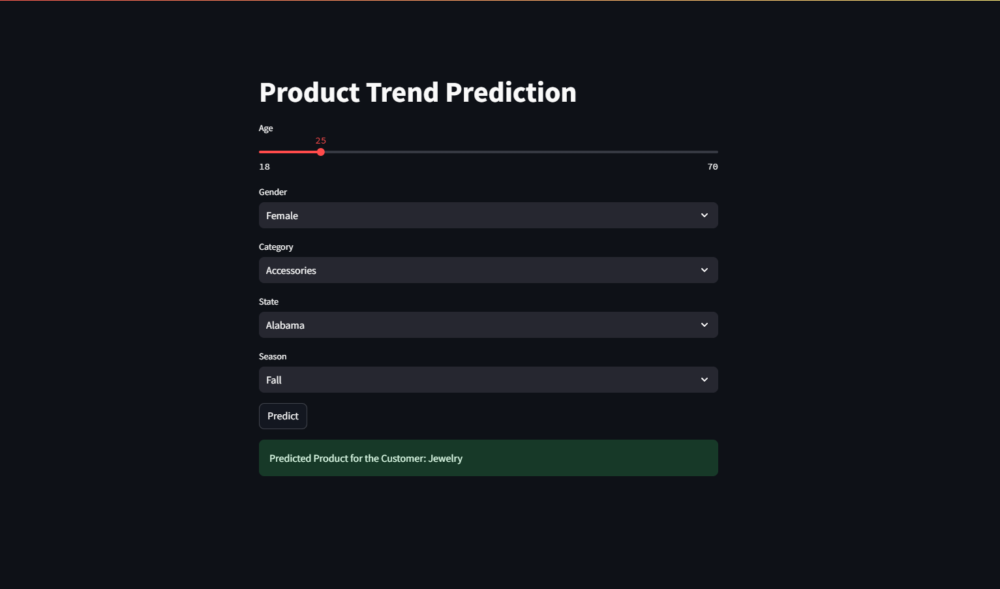

# Shopping Online Analysis (10/2024 - 11/2024)
## Now you can directly use my model on Streamlit
https://predictitem.streamlit.app/

## Project Overview

In this project, I utilize Python for data cleaning and organization, alongside Tableau for visual analysis. The aim is to uncover relationships within the data and identify optimal products for targeted marketing campaigns.

## Key Components

### 1. Data Cleaning and Organization
- **Python Data Cleaning**: 
  - Handling missing values
  - Removing duplicates
  - Normalizing data formats

### 2. Visual Analysis with Tableau
- **Creating Dashboards**: 
  - Design interactive dashboards to visualize key metrics, including total sales and sales trends.
  
- **Exploring Relationships**: 
  - Analyze various factors affecting sales performance.

### 3. Identifying Optimal Products
- **Performance Analysis**: 
  - Identify top-selling products and those with high growth potential.

- **Campaign Recommendations**: 
  - Provide suggestions for marketing campaigns aimed at optimizing revenue.

### 4. Predictive Modeling
- **Product Suggestion Model**: 
  - Develop a recommendation system using the Random Forest model to suggest products to customers during their shopping experience.

## Technologies Used
- Python: For data cleaning and building predictive models.
- Tableau: For visualizing data and creating dashboards.

## Getting Started
1. Clone the repository.
2. Install the required Python packages.
3. Open Tableau to explore the visualizations and dashboards.

## Conclusion
This analysis aims to enhance decision-making for e-commerce strategies by providing actionable insights derived from data.
